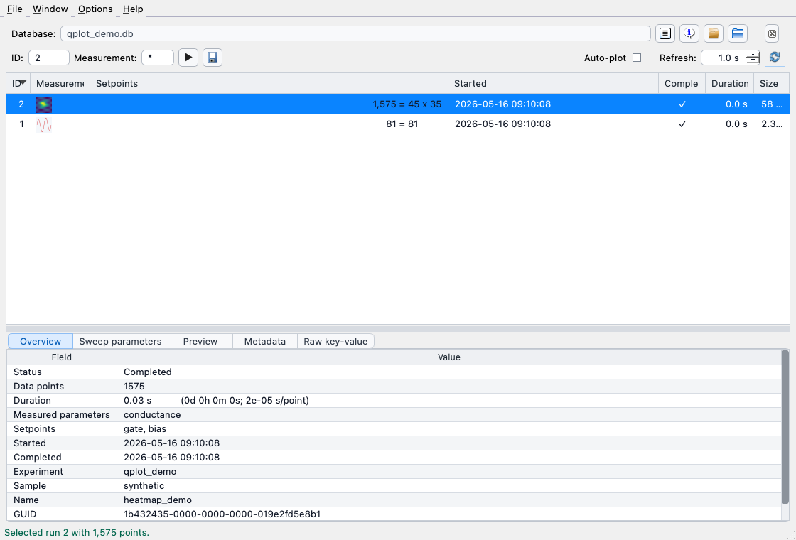
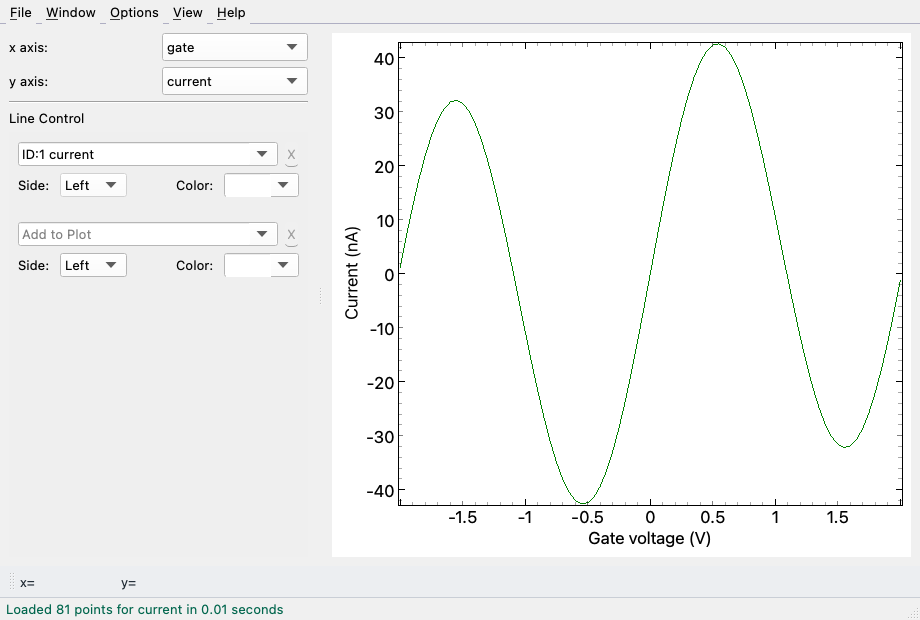
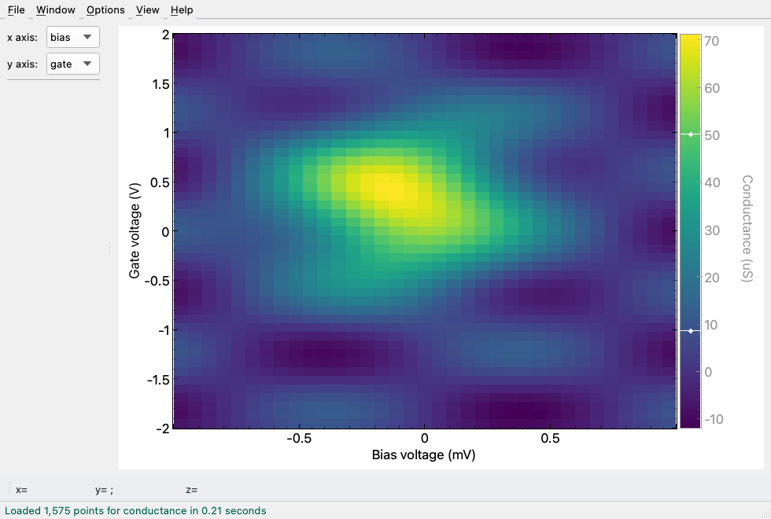
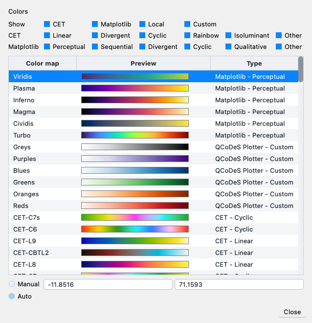

# Demo Data

qPlot does not keep generated QCoDeS databases in the repository. For demos,
screenshots, and manual live-refresh checks, use the local helper scripts from
the repository root.

## Screenshots

The committed screenshots below are generated from a small synthetic database.









## Regenerate Screenshots

Run:

```console
python scripts/capture_demo_screenshots.py
```

The script creates a temporary synthetic database under the system temp
directory by default, starts qPlot offscreen, and overwrites the PNG files in
`docs/assets`. Set `QPLOT_DEMO_WORKDIR` to choose a different working folder.

## Generate Synthetic Data

Run:

```console
python scripts/liveplot.py
```

The script creates or updates:

```text
tests/data/qplot-demo.db
```

That database is ignored by Git. Regenerate it when you need fresh example runs
for screenshots or manual testing.

## Manual Demo Flow

1. Start qPlot with `python scripts/manual_run.py`.
2. Load `tests/data/qplot-demo.db`.
3. Select a run with both line and heatmap parameters.
4. Capture any additional workflow-specific views that are not covered by
   `scripts/capture_demo_screenshots.py`.

Keep screenshots focused on the actual application state. Avoid capturing local
paths, personal configuration values, or unrelated desktop windows.

## Refresh Testing

For local performance and live-refresh checks, use:

```console
python scripts/time_stress.py
```

The script writes timing CSV files into the configured qPlot directory, usually
`~/.qplot`. Those files are local diagnostics, not source assets.
