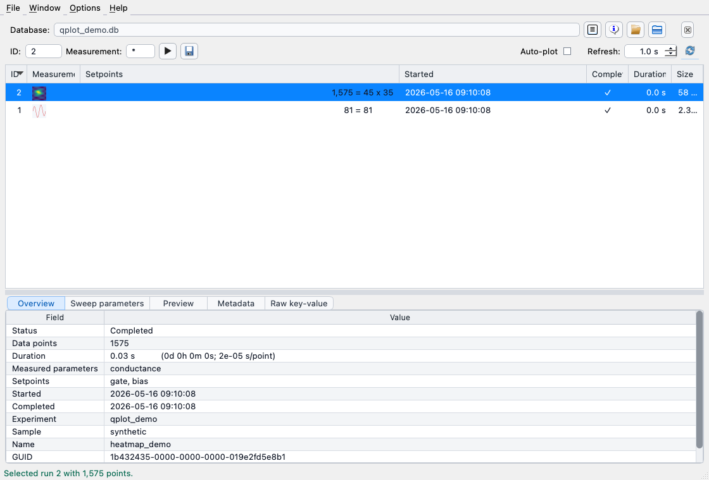
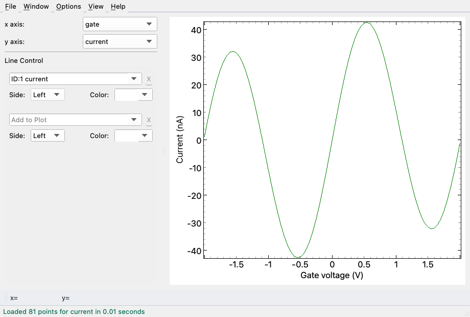
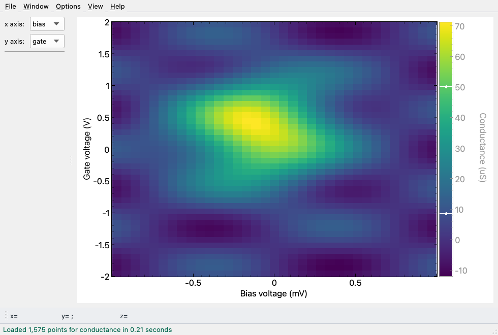
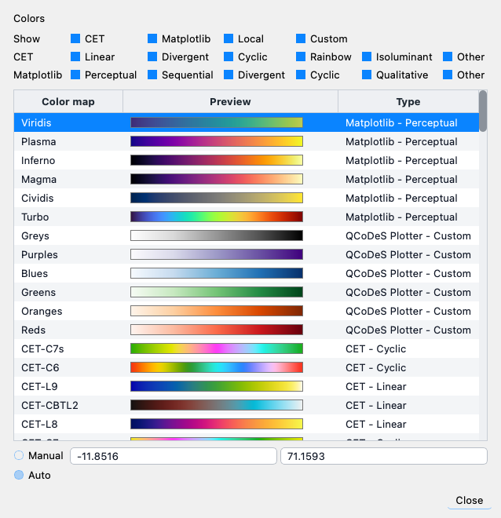

# Demo Data

qPlot does not keep generated QCoDeS databases in the repository. For demos,
screenshots, and manual live-refresh checks, use the local helper scripts from
the repository root.

## Generate a Test Database

In qPlot, use `File -> Generate Test Data -> Create Example CSV...` to choose
where to save a ready-to-use specification. qPlot creates the file, reveals it
in Finder on macOS, or opens its containing folder in the platform file manager.
Edit the CSV in a spreadsheet application, then use
`File -> Generate Test Data -> Generate Database from CSV...` to choose the CSV
and its output `.db` file. Generation runs in the background so qPlot remains
responsive.

For performance and scaling tests, use
`File -> Generate Test Data -> Export CSV Collection...`. The ten installed
instruction files form a cumulative series: every file contains all the runs
from its predecessor, followed by three larger 2D runs. The nominal database
sizes and largest grids are:

| File | Approximate database size | Largest 2D run |
| --- | ---: | ---: |
| `qplot_test_db_01_10mb.csv` | 10 MB | 201 x 301 |
| `qplot_test_db_02_25mb.csv` | 25 MB | 301 x 451 |
| `qplot_test_db_03_50mb.csv` | 50 MB | 401 x 601 |
| `qplot_test_db_04_100mb.csv` | 100 MB | 551 x 851 |
| `qplot_test_db_05_250mb.csv` | 250 MB | 1001 x 1501 |
| `qplot_test_db_06_500mb.csv` | 500 MB | 1251 x 1901 |
| `qplot_test_db_07_1gb.csv` | 1 GB | 1801 x 2701 |
| `qplot_test_db_08_5gb.csv` | 5 GB | 5001 x 7501 |
| `qplot_test_db_09_10gb.csv` | 10 GB | 5601 x 8401 |
| `qplot_test_db_10_30gb.csv` | 30 GB | 11001 x 17001 |

Sizes are estimates calibrated against QCoDeS SQLite output and will vary with
QCoDeS and SQLite versions. Large databases can take a long time to generate.
Ensure the destination has comfortably more free space than the nominal size;
overwriting an existing database temporarily requires space for both files.

The installed `qplot-generate-db` command provides the same workflow from a
terminal. Start by writing an example CSV:

```console
qplot-generate-db --write-example test-runs.csv
```

Export the complete installed collection with:

```console
qplot-generate-db --write-collection test-db-csv-series
```

Edit the CSV in a spreadsheet application, then generate the database:

```console
qplot-generate-db test-runs.csv test-runs.db
```

During generation, qPlot prints timestamped start and stop messages for the
database and each run, including elapsed times and whether generation completed,
was cancelled, or failed. These appear alongside QCoDeS's existing
`Starting experimental run with id:` messages.

Every nonblank CSV row creates one run, named `run_1`, `run_2`, and so on. A 1D
row sweeps `V_SD`; a 2D row sweeps both `V_SD` and `V_G`. Each measured signal
is the sum of two sinusoids with independently randomised amplitudes,
frequencies, and phases. For 2D runs, each sinusoid also receives independent
frequencies along the two sweep axes, producing varied plane-wave patterns.
The measured parameter name, label, unit, sweep ranges, and point counts are set
in the CSV. Existing CSV or database files are not replaced unless
`--overwrite` is supplied. Collection export also refuses to replace existing
collection files without `--overwrite`. Even with `--overwrite`, database
generation refuses publication if the destination changed while generation was
running or if a `-wal`, `-shm`, or `-journal` sidecar is present. Close the
application using that database, or choose another output path; qPlot never
removes or modifies those destination sidecars. Every generated test database
carries a unique internal generation token and write epoch. Later writes to
its existing tables advance that epoch, allowing a fresh qPlot process to prove
that a WAL belongs to the published main and show its committed values. A WAL
with a different or unadvanced lineage is refused with recovery instructions
instead of being silently ignored. If a sidecar is detected before the atomic
swap completes, qPlot restores the old main and retains an explicit
`.qplot-publishing` safety guard until the owning SQLite application has
resolved the sidecars.

Run `qplot-generate-db --help` for the complete command reference.

## Screenshots

The committed screenshots below are generated from a small synthetic database.









## Regenerate Screenshots

Run:

```console
python scripts/capture_demo_screenshots.py
```

The script creates a temporary synthetic database under the system temp
directory by default, starts qPlot offscreen, and overwrites the PNG files in
`docs/assets`. Set `QPLOT_DEMO_WORKDIR` to choose a different working folder,
or `QPLOT_DEMO_ASSET_DIR` to write screenshots somewhere other than
`docs/assets`.

## Generate Synthetic Data

Run:

```console
python scripts/liveplot.py
```

The script creates or updates:

```text
tests/data/qplot-demo.db
```

That database is ignored by Git. Regenerate it when you need fresh example runs
for screenshots or manual testing.

## Manual Demo Flow

1. Start qPlot with `python scripts/manual_run.py`.
2. Load `tests/data/qplot-demo.db`.
3. Select a run with both line and heatmap parameters.
4. Capture any additional workflow-specific views that are not covered by
   `scripts/capture_demo_screenshots.py`.

Keep screenshots focused on the actual application state. Avoid capturing local
paths, personal configuration values, or unrelated desktop windows.

## Refresh Testing

For local performance and live-refresh checks, use:

```console
python scripts/time_stress.py
```

The script writes timing CSV files into the configured qPlot directory, usually
`~/.qplot`. Those files are local diagnostics, not source assets.
